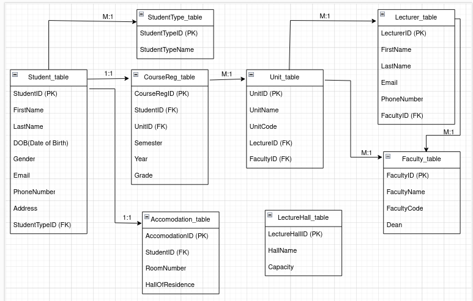
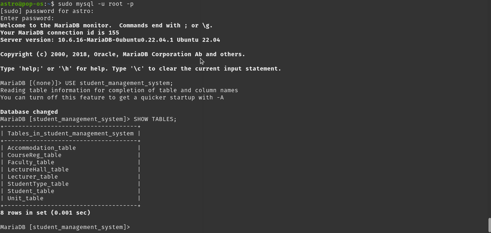
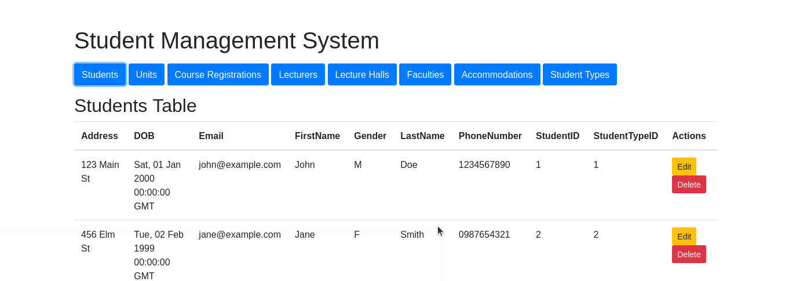
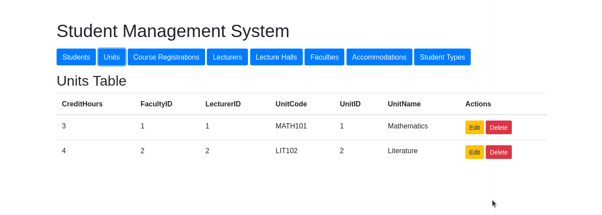
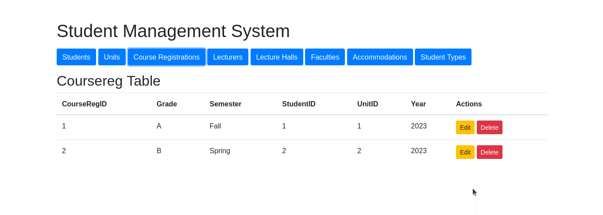
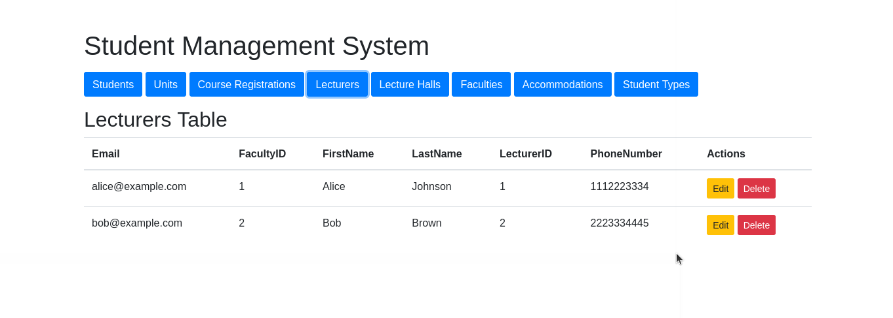
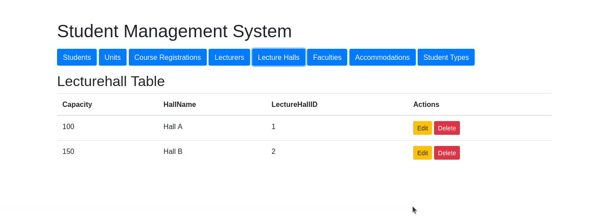
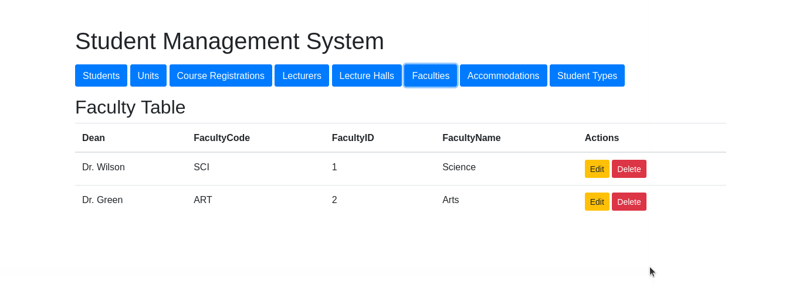
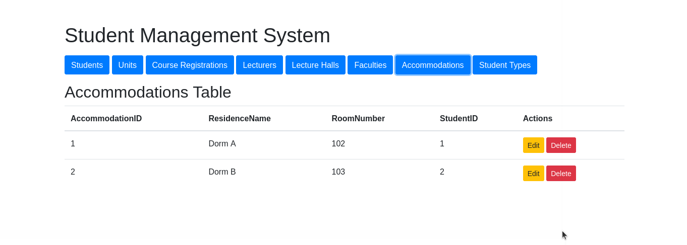
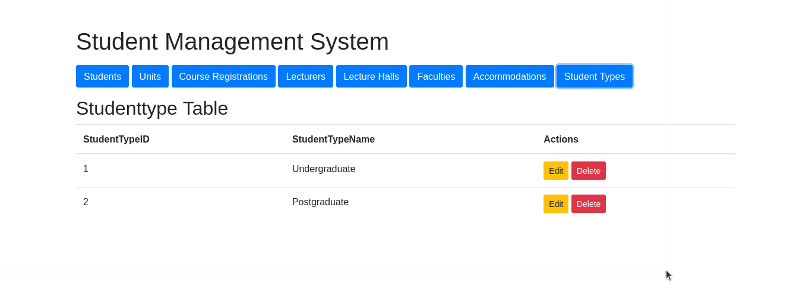

# Student Management System
Based on the tables, I constructed an Entity-Relationship Diagram (ERD) in order to build a `Student Management System`. Below, the ERD should appear as follows:



<a href="https://app.diagrams.net/#G1UNT1M15g1PocLwE5bQYinulUBKU3xkf_#%7B%22pageId%22%3A%22InMkDCBhClccY3GWE_AD%22%7D">Here's the link to the ERD</a>

The requirements listed below were utilized to develop the system:
<ol>
<li> Backend: </li>
<ul>
<li> Python & Flask </li>
<li> MySQL </li>
</ul>
<li> Frontend: HTML/Javascript </li>
</ol>

## Database of the system


### Database Schema
```sh
CREATE TABLE StudentType_table (
    StudentTypeID INT PRIMARY KEY,
    TypeName VARCHAR(50) NOT NULL
);

CREATE TABLE Student_table (
    StudentID INT PRIMARY KEY,
    FirstName VARCHAR(50),
    LastName VARCHAR(50),
    DOB DATE,
    Gender CHAR(1),
    Email VARCHAR(100),
    PhoneNumber VARCHAR(10),
    Address VARCHAR(255),
    StudentTypeID INT,
    FOREIGN KEY (StudentTypeID) REFERENCES StudentType_table(StudentTypeID)
);

CREATE TABLE Faculty_table (
    FacultyID INT PRIMARY KEY,
    FacultyName VARCHAR(100) NOT NULL,
    FacultyCode VARCHAR(50) NOT NULL,
    Dean VARCHAR(100)
);

CREATE TABLE Lecturer_table (
    LecturerID INT PRIMARY KEY,
    FirstName VARCHAR(50) NOT NULL,
    LastName VARCHAR(50) NOT NULL,
    Email VARCHAR(100),
    PhoneNumber VARCHAR(15),
    FacultyID INT,
    FOREIGN KEY (FacultyID) REFERENCES Faculty_table(FacultyID)
);

CREATE TABLE Unit_table (
    UnitID INT PRIMARY KEY,
    UnitName VARCHAR(100) NOT NULL,
    UnitCode VARCHAR(50) NOT NULL,
    CreditHours INT,
    LecturerID INT,
    FacultyID INT,
    FOREIGN KEY (LecturerID) REFERENCES Lecturer_table(LecturerID),
    FOREIGN KEY (FacultyID) REFERENCES Faculty_table(FacultyID)
);

```
## 1. Student Table



## 2. Units Table


## 3. Course Registration Table


## 4. Lecturers Table


## 5. Lecture Hall Table


## 6. Faculty Table


## 7. Accommodations Table


## 8. Student Type Table


# Steps on how to download and run the system
1. Clone the repository
```sh
git clone https://github.com/Gtindi/student_management_system.git
cd student_maagement_system
```

2. Set up a virtual environment and install dependencies:
```sh
python3 -m venv venv
source venv/bin/activate
```


## Usage

Run the Flask application:
```sh
python3 app.py
```